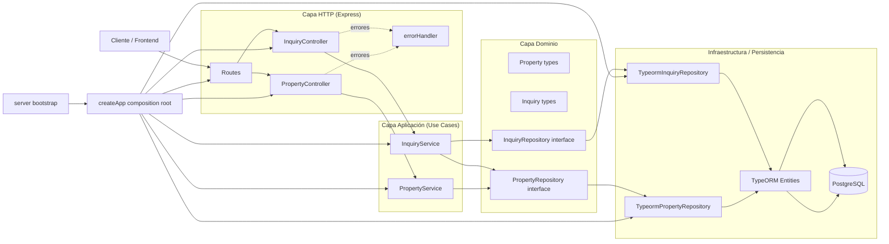
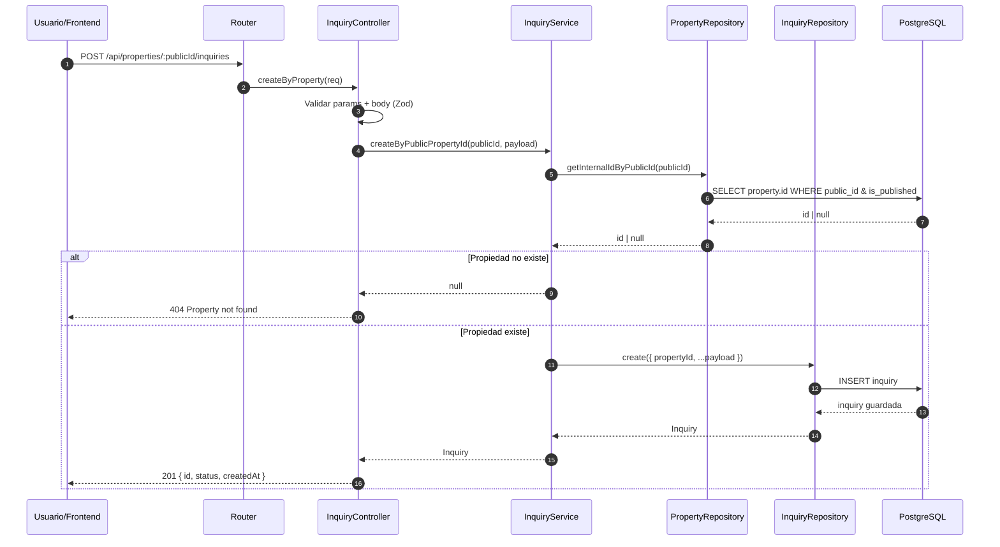

# Arquitectura de Habita Backend

Este documento describe el patrón de diseño y la arquitectura utilizada en `habita-backend`.

## Resumen

El proyecto usa una arquitectura por capas con separación de responsabilidades:

- **HTTP/API**: recibe requests y devuelve responses.
- **Aplicación (servicios/casos de uso)**: coordina la lógica de negocio.
- **Dominio**: define contratos y modelos de negocio.
- **Infraestructura**: implementa acceso a datos con TypeORM y PostgreSQL.

Además, aplica:

- **Repository Pattern** (contratos + implementaciones concretas).
- **Dependency Injection manual** en el composition root.

## ¿Qué hace cada parte?

### 1) Bootstrap y composición

- `src/server.ts`: inicializa la conexión a DB y levanta Express.
- `src/app.ts`: compone dependencias (repositorios → servicios → controladores → rutas).

Objetivo: mantener desacoplada la construcción de objetos de su uso.

### 2) Rutas (entrada HTTP)

- `src/routes/healthRoutes.ts`
- `src/routes/propertyRoutes.ts`

Objetivo: mapear endpoints a handlers de controladores, sin lógica de negocio.

### 3) Controladores

- `src/controllers/PropertyController.ts`
- `src/controllers/InquiryController.ts`

Responsabilidades:

- Validar entrada (`params`, `query`, `body`) con Zod.
- Traducir errores funcionales a códigos HTTP (`400`, `404`, etc.).
- Delegar lógica al servicio.

### 4) Servicios (casos de uso)

- `src/services/PropertyService.ts`
- `src/services/InquiryService.ts`

Responsabilidades:

- Orquestar reglas de aplicación.
- Coordinar uno o más repositorios.
- No acoplarse a Express ni a TypeORM directamente.

Ejemplo: `InquiryService.createByPublicPropertyId` traduce `publicId` a ID interno y recién ahí crea la consulta.

### 5) Dominio

- `src/domain/entities/property.ts`
- `src/domain/entities/inquiry.ts`

Responsabilidades:

- Definir tipos y contratos de negocio.
- Proveer un lenguaje común para servicios y repositorios.

### 6) Repositorios

Contratos:

- `src/repositories/interfaces/PropertyRepository.ts`
- `src/repositories/interfaces/InquiryRepository.ts`

Implementaciones concretas:

- `src/repositories/typeorm/TypeormPropertyRepository.ts`
- `src/repositories/typeorm/TypeormInquiryRepository.ts`

Responsabilidades:

- Encapsular consultas, joins, filtros y mapeos de persistencia.
- Convertir entidades ORM a modelos de dominio.

### 7) Persistencia (TypeORM + PostgreSQL)

- `src/db/data-source.ts`: configuración de conexión y migraciones.
- `src/db/entities/*.ts`: entidades y relaciones de base de datos.

### 8) Middleware transversal

- `src/middlewares/errorHandler.ts`: manejo centralizado de errores no controlados.

---

## Diagrama 1: Arquitectura general

## Diagrama 2: Flujo `POST /api/properties/:publicId/inquiries`

## Beneficios de este diseño

- Menor acoplamiento entre HTTP, negocio y persistencia.
- Mayor testabilidad (servicios y controladores pueden mockear repositorios).
- Flexibilidad para cambiar infraestructura (por ejemplo, otro ORM) manteniendo contratos.
- Código más mantenible al tener responsabilidades claras por capa.
